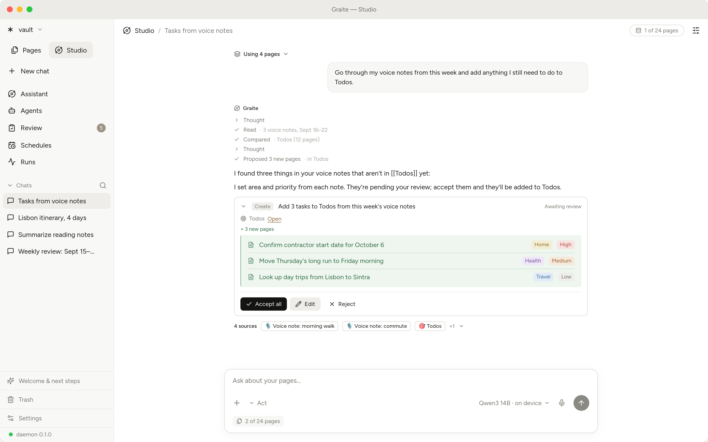
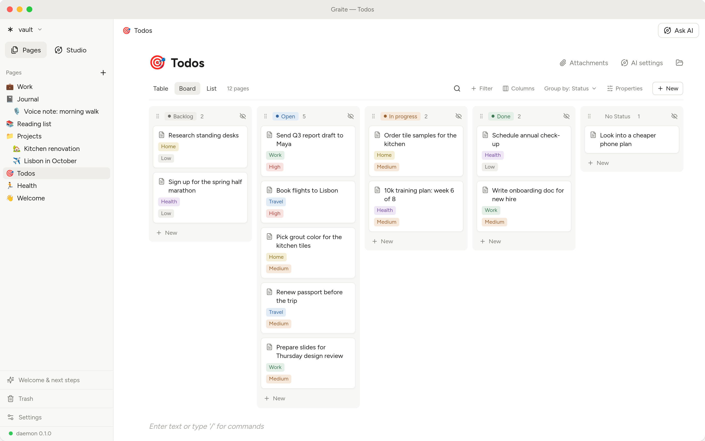
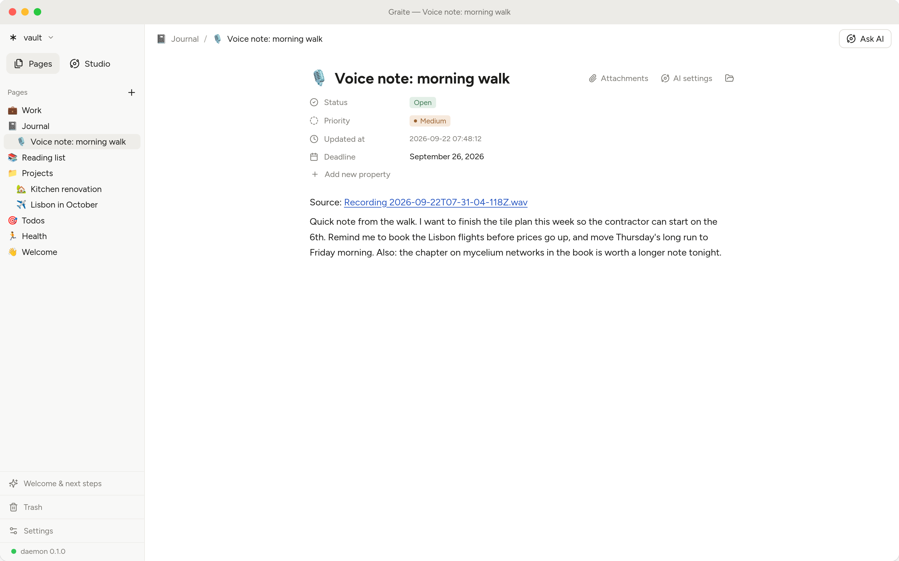
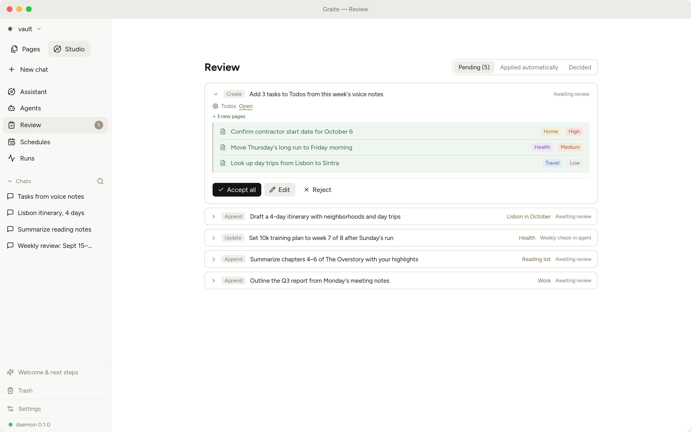
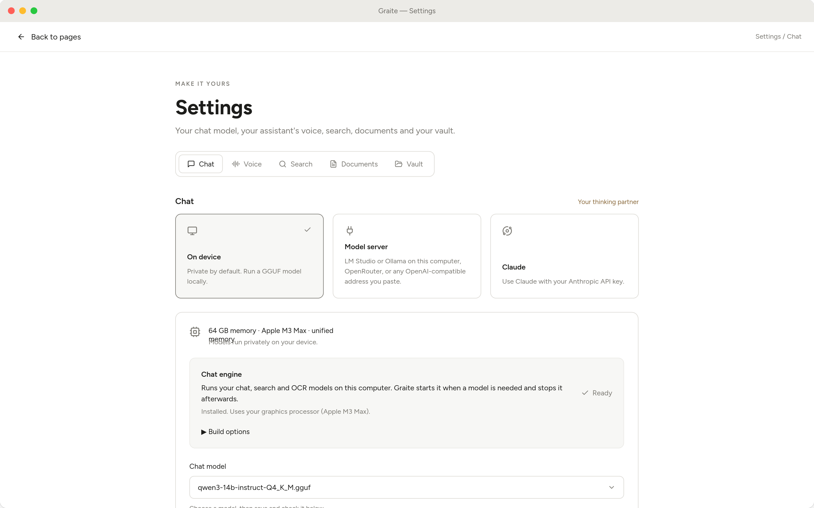

<p align="center"></p>

# Graite

**A local-first knowledge workspace with agents that live on your machine.**

<picture>
  <source media="(prefers-color-scheme: dark)" srcset="docs/screenshots/chat-expanded-dark.png">
  
</picture>

Graite is a desktop app that opens a folder of Markdown files as a vault and gives you a
Notion-style block editor over it, local AI models that run through llama.cpp and
whisper.cpp, and agents that can read everything you let them read but **write nothing
directly**: every change an agent wants to make is a diff you accept, reject or edit.

- **Files are the product.** The vault is plain Markdown that Obsidian, git and any text editor
  open unchanged. Delete Graite's `.graite/` folder and you lose nothing you wrote.
- **One writer.** Every byte written into the vault goes through one module in the daemon, so
  hashes, versions, activity logs and conflict detection are trustworthy.
- **Agents propose, humans dispose.** Agent tool sets contain no write tools. Autonomy is
  granted explicitly, per folder, per kind of change, and is always revertible.
- **No torch.** Chat, embeddings, vision and speech run through small native GGML engines.
  The daemon stays small and installs offline.

Cloud models (Claude, OpenAI-compatible servers, OpenRouter) plug into the same interface as an
optional escape hatch. The product does not depend on them.

> **Status: pre-release (0.1.0).** The source is complete and the app runs on Linux, macOS
> and Windows. Packaged builds are unsigned previews. Read `ROADMAP.md` for what is shipped,
> in progress and planned.

## A look inside

**Boards, tables and lists.** Any folder of pages can be a board, table or list. This is a
Todos collection grouped by status. Every card is still a plain Markdown page underneath.

<picture>
  <source media="(prefers-color-scheme: dark)" srcset="docs/screenshots/board-dark.png">
  
</picture>

**Notes.** A Notion-style block editor over your Markdown. A voice note keeps its properties,
the original recording and a local Whisper transcript on the same page.

<picture>
  <source media="(prefers-color-scheme: dark)" srcset="docs/screenshots/page-dark.png">
  
</picture>

**Review.** Agents propose, you decide. Every change an agent wants to make waits in the review
queue as a diff you accept, edit or reject. Every applied change has a snapshot, so you can
always go back.

<picture>
  <source media="(prefers-color-scheme: dark)" srcset="docs/screenshots/review-expanded-dark.png">
  
</picture>

**Local models.** Chat, embeddings and speech run on your own hardware through llama.cpp and
whisper.cpp, with no per-token bill. Cloud providers are optional and use your own key.

<picture>
  <source media="(prefers-color-scheme: dark)" srcset="docs/screenshots/settings-dark.png">
  
</picture>

## What you get

- A `/` block editor with headings, lists, toggles, callouts, tables, code, images, audio, PDF,
  page links and board/table/list views, all round-tripping to Obsidian-compatible Markdown.
- Pages as folders: typing `/page` creates a child page that owns its attachments,
  instructions and data.
- A curated catalog of local models (chat, embeddings, Whisper, OCR, voice) downloaded from
  Hugging Face with checksums, plus bring-your-own-key cloud providers.
- Per-folder `AGENTS.md` instructions and skills that cascade root to leaf.
- A review queue: proposals as diffs, inline on the page and in one view, with conflict
  detection and one-click revert.
- A background daemon with a job queue, cron schedules, live notes, an embedding worker,
  transcription and OCR jobs.
- Hybrid semantic + full-text search over every page, transcript and OCR'd document.
- A personal assistant with realtime voice, and an MCP server so local clients can work
  through the same write-free tools.

## Install

Download the build for your platform from the
[Releases](https://github.com/graite/graite-desktop/releases) page. On first launch pick a
folder (an existing Obsidian vault works) and install an engine and a chat model from
Settings. Everything is stored under `~/.graite/`.

The preview builds are not signed yet: on macOS run `xattr -cr /Applications/Graite.app` after
copying the app; on Windows SmartScreen shows "unknown publisher".

## Develop

Prerequisites: [Rust](https://rustup.rs) (stable), [pnpm](https://pnpm.io) 10, Node 24,
[uv](https://docs.astral.sh/uv/) with Python 3.12, [just](https://github.com/casey/just), and
the [Tauri 2 system dependencies](https://tauri.app/start/prerequisites/) for your OS.

```bash
git clone https://github.com/graite/graite-desktop.git
cd graite-desktop
just setup      # creates apps/daemon/.env, installs Python and Node dependencies
just dev        # daemon on the example vault + the desktop app with hot reload
just test       # pytest + vitest + cargo test
just lint       # ruff, mypy, prettier, eslint, tsc, rustfmt, clippy
```

`docs/development.md` covers the layout, environment variables, building a packaged app,
the smoke tests and releasing. `ARCHITECTURE.md` explains how the shell, the daemon and the vault fit
together; `VISION.md` says why. `CONTRIBUTING.md` explains how changes land and `AGENTS.md` has the rules every change follows.

## Repository layout

```
apps/desktop     Tauri 2 shell + React 19 UI (BlockNote editor, review, chat, settings)
apps/daemon      Python 3.12 FastAPI daemon: vault, index, models, agents, jobs, voice, MCP
packages/        md-convert (Markdown <-> BlockNote) and api-types (generated from OpenAPI)
examples/vault   the small vault `just dev` opens
docs/            development guide, vault format, decision log; docs/design/ holds deeper specs
scripts/         build, smoke-test and launcher scripts
```

## License

Apache License 2.0. See `LICENSE`, `NOTICE` and `THIRD_PARTY_NOTICES.md`.
